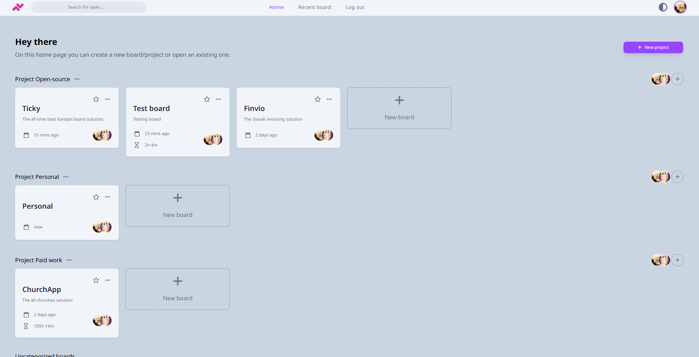
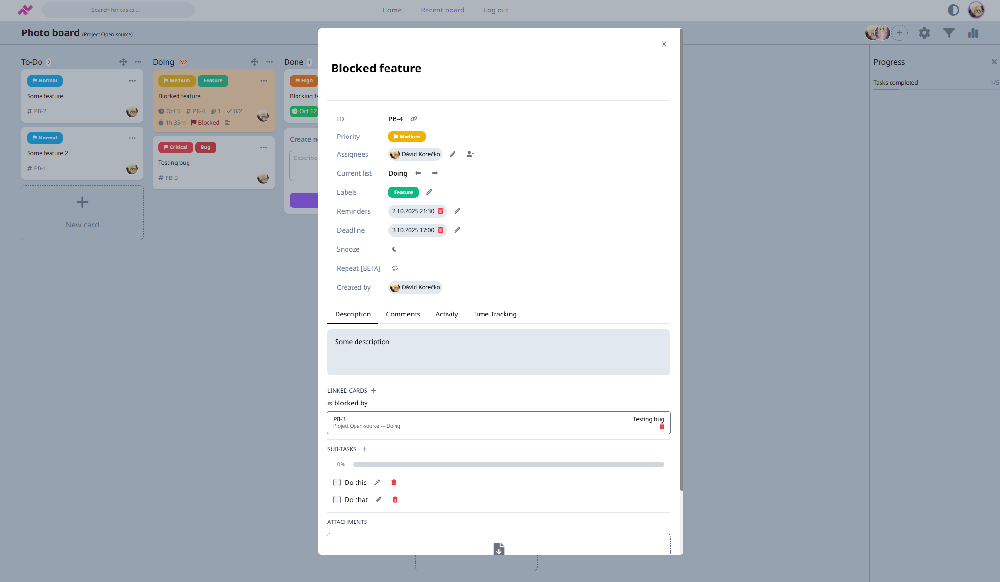
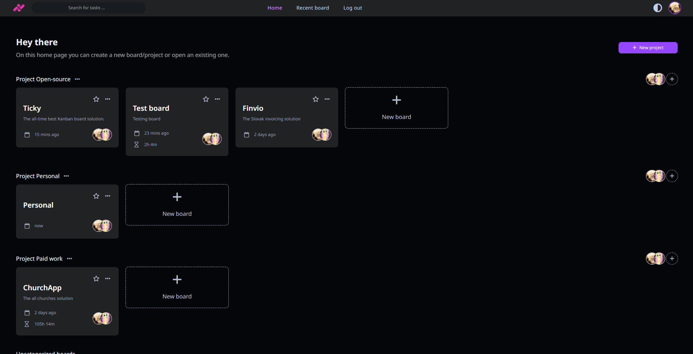
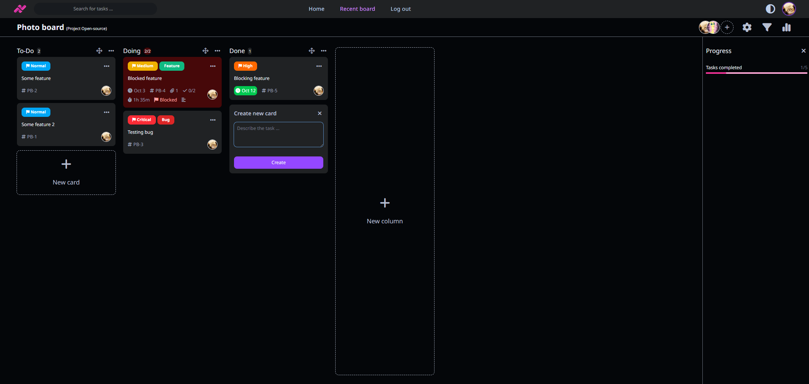
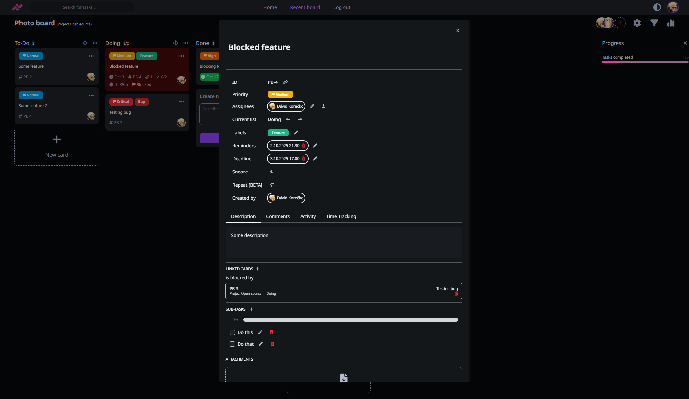

<p align="center">
    
</p>

# Ticky

Ticky is a modern, feature-rich task management system with Kanban-style boards, built using ASP.NET Core Blazor. It is designed to help you manage your projects and tasks efficiently, whether for personal use or team collaboration. Ticky is fully open-source and free to use (and will always be), with a focus on simplicity and usability.

## ❓ The why

You might be thinking, "Another Kanban app?" and that's fair! As someone who navigated between Trello for personal tasks and commercial projects, and Jira at work, I often found myself searching endlessly for "power-ups" that eventually turned into paid features, or trying open-source solutions that didn't quite hit the mark on what I needed or simply lacked the right feel. Ticky was born from that experience - a desire to build something truly comprehensive, intuitive, and always accessible. It's my answer to those frustrations, and it means Ticky will always be free and fully open-source.

## 🌟 Features

Ticky is packed with powerful features designed to make your task management seamless and enjoyable:

- **Projects**: Create and manage projects to group your boards.
- **Boards**: Create and manage your own Kanban boards. You can even make them favorites to stay atop the list.
- **Templates**: You can clone boards, therefore allowing you to use boards as templates.
- **Columns**: Each board can have any amount of columns, all of which are collapsible. You can specify a max card limit, automatically mark the cards within the column as finished and automatically order them.
- **Cards**: Create, edit, and move task cards between columns with drag-and-drop functionality. At a glance see all important information about a card. Decide where new cards are placed.
- **Subtasks**: Break down tasks into smaller, manageable subtasks with completion tracking.
- **Deadline Management**: Set and track deadlines with color-coded indicators.
- **Time Tracking**: Track time spent on tasks with built-in timer functionality.
- **Labels and Priorities**: Organize tasks with custom labels and priority levels. Label colors are fully customizable.
- **Attachments**: Upload and manage files associated with tasks.
- **Reminders**: Set email reminders for tasks.
- **Card Linking**: Link related cards together (Jira-like).
- **Activity Tracking**: Monitor all changes and activities on tasks.
- **Comments**: Leave comments on cards to discuss and provide other useful information.
- **User Management**: You can add users on the project level or on the board level, choosing between a Member and an Admin role. Also possible to disable user signups.
- **Admin Panel**: For creating, editing and deleting users as an admin. Mostly for when not using SMTP.
- **Email Notifications**: Receive notifications for deadlines, and reminders.
- **Progress**: Track your progress within a board by seeing how many tasks have already been completed.
- **App-wide Search**: Find cards from other boards based on their unique identificator (like TEST-1), jump directly to them.
- **Recent board**: Immediately go back to your most recent board.
- **Auto-generated avatars** (optional): To make things more colorful.
- **Able to do run offline**: Ability to run fully offline, disabling the avatar service, having all the files bundled on the server and not using SMTP.
- **Dark Mode**: A sleek dark mode for less strain on your eyes.
- **Snooze Cards**: Reduce clutter by snoozing cards that cannot be worked on just yet.
- **Repeat Cards**: Automatically repeat cards at specified intervals, perfect for recurring tasks.
- **Responsive Design**: Take your tasks with you, no matter whether you are at your computer or running errands with just your phone.
- **Completion Confetti**: Feel the satisfaction of completing each task with a bunch of confetti, there to celebrate your success.
- **Filtering**: Easily find and organize tasks based on various criteria.
- **Trello import**: You can import your Trello boards, including the ability to map all the assigned members from your Trello board to Ticky users.
- ... and more!

## 📋 Prerequisites

- **Docker** installed on your system
  - Windows: Download and install Docker Desktop from [docker.com](https://www.docker.com/products/docker-desktop/)
  - macOS: Download and install Docker Desktop from [docker.com](https://www.docker.com/products/docker-desktop/)
  - Linux: Install Docker Engine and Docker Compose via your package manager
- **Basic text editor** (Notepad, VS Code, etc.) to create/edit the configuration file
- **SMTP Server** (optional) - for email notifications and password resets
  - Gmail, Outlook, or any email provider that supports SMTP
  - If you don't have SMTP, Ticky will work without email features

## 🚀 Getting Started

### Using Docker (Recommended)

**Step 1: Verify Docker Installation**
Open a terminal/command prompt and run:

```bash
docker --version
```

If these commands work, you're ready to proceed!

**Step 2: Create Project Directory**
Create a new folder for Ticky on your computer:

```bash
mkdir ticky-app
cd ticky-app
```

**Step 3: Create Configuration File**
Create a new file called `docker-compose.yaml` in your project folder and copy the following content. **Important**: Replace `your-secure-password` with a strong password of your choice (use the same password in all places where it appears):

```yaml
services:
  ticky-app:
    image: ghcr.io/dkorecko/ticky:latest # or pin to a specific version (like v1.0.0) for manual updates
    container_name: ticky-app
    ports:
      - "4088:8080"
    restart: unless-stopped
    volumes:
      - ./data/app/uploaded:/app/wwwroot/uploaded
    environment:
      - DB_HOST=ticky-db
      - DB_NAME=ticky # Database name, can be customized
      - DB_USERNAME=ticky # Database username, can be customized
      - DB_PASSWORD=your-secure-password
      #- FULLY_OFFLINE=true # Uncomment this if you want to disable the avatar service and run fully offline.
      #- DISABLE_USER_SIGNUPS=true # Uncomment to disable user self-registration. When true, only admins can create new users via the Admin Panel.
      - BASE_URL=http://localhost:4088 # Base URL for generating clickable links in emails (e.g., reminder emails). Change to the base URL you use to access Ticky.
      - SMTP_ENABLED=true # Change this to false to ignore SMTP configuration and disable SMTP setup. Resetting password via typical password reset won't work (will need to be reset by an admin via the Admin Panel), as well as reminders and notifications. Can be enabled at any time.
      - SMTP_HOST=your-smtp-host
      - SMTP_PORT=your-smtp-port
      - SMTP_DISPLAY_NAME=Ticky
      - SMTP_EMAIL=your-email@example.com
      - SMTP_USERNAME=your-smtp-username
      - SMTP_PASSWORD=your-smtp-password
      - SMTP_SECURITY=true
    depends_on:
      ticky-db:
        condition: service_healthy
  ticky-db:
    image: mysql:8
    container_name: ticky-db
    restart: unless-stopped
    environment:
      MYSQL_DATABASE: ticky # This should match DB_NAME in ticky-app container
      MYSQL_USER: ticky # This should match DB_USERNAME in ticky-app container
      MYSQL_ROOT_PASSWORD: your-secure-password
      MYSQL_PASSWORD: your-secure-password # This should match DB_PASSWORD
    healthcheck:
      test: ["CMD", "mysqladmin", "ping", "-h", "localhost"]
      timeout: 2s
      retries: 30
    volumes:
      - ./data/mysql:/var/lib/mysql
```

**Step 4: Configure Email (Optional)**
If you want email notifications and password reset functionality:

- Replace `your-smtp-host`, `your-smtp-port`, `your-email@example.com`, etc. with your actual email provider settings
- For Gmail: Use `smtp.gmail.com`, port `587`, and create an [App Password](https://support.google.com/accounts/answer/185833)
- If you don't want email features, change `SMTP_ENABLED=true` to `SMTP_ENABLED=false`

**Step 5: Start Ticky**
In your terminal/command prompt, navigate to your project folder and run:

```bash
docker compose up -d
```

This will:

- Download the necessary Docker images (this may take a few minutes the first time)
- Create and start the Ticky application and database
- Set up data storage folders automatically

**Step 6: Access Your Ticky Instance**

1. Open your web browser and go to: `http://localhost:4088`
2. Log in with the default admin account:
   - **Email**: `admin@ticky.com`
   - **Password**: `abc123`
3. You'll be prompted to change these credentials immediately for improved security
4. After changing your password, you'll be logged out - just log back in with your new credentials

**Step 7: Add Users (If SMTP Disabled)**
If you disabled SMTP, you'll need to create user accounts manually through the Admin Panel. If SMTP is enabled, users can register themselves.

### Troubleshooting

- **Port already in use**: Change `4088:8080` to `4089:8080` (or any other available port) in the docker-compose.yaml file
- **Permission errors**: Make sure Docker Desktop is running and you have proper permissions. In Linux, sudo can be used in front of the commands.
- **Can't access the app**: Wait a minute after starting - the database needs time to initialize on first run

### Manual Setup

1. Clone the repository:

   ```
   git clone https://github.com/dkorecko/Ticky.git
   cd Ticky
   ```

2. Set up your environment variables.

3. Run the application:
   ```
   dotnet run --project Ticky.Web/Ticky.Web.csproj
   ```

## 📷 Preview








## 🤝 Community

If you have any questions, need help setting up, want to share your feedback or discuss ideas and new features, then I have created a [Discord](https://discord.gg/DHCZqYwUUb) server. I’m always eager to hear from users and improve Ticky based on your needs.

## 🛠️ Project Structure

- **Ticky.Base**: Core entities, models, and shared components.
- **Ticky.Internal**: Data access, services, and business logic.
- **Ticky.Web**: Blazor web application, UI components, and user interface.

## 🔧 Configuration

### Database Setup

The application automatically applies migrations on startup.

## 🧪 Development

### Building

```
dotnet build
```

### Running Tests

```
dotnet test
```

### Watch Mode

```
dotnet watch
```

## 🔄 CI/CD

The project includes GitHub Actions workflows for CI/CD:

- Automated builds and tests on pull requests
- Docker image publishing to GitHub Container Registry (GHCR) on releases

## 📝 Contributing

Contributions are welcome! See the [CONTRIBUTING.md](CONTRIBUTING.md) file for details.

## 📄 License

This project is licensed under the MIT License - see the [LICENSE](LICENSE) file for details.

## 👏 Acknowledgements

- [Blazor](https://dotnet.microsoft.com/apps/aspnet/web-apps/blazor) - Web framework used
- [Entity Framework Core](https://docs.microsoft.com/en-us/ef/core/) - ORM used
- [TailwindCSS](https://tailwindcss.com/) - CSS framework
- [Font Awesome](https://fontawesome.com/) - Icons
- [Sortable.js](https://github.com/SortableJS/Sortable) - Drag-and-drop functionality

## 📞 Contact

Have questions or feedback? I'd love to hear from you! Please feel free to open an issue on this repository.

---

Made with ❤️
